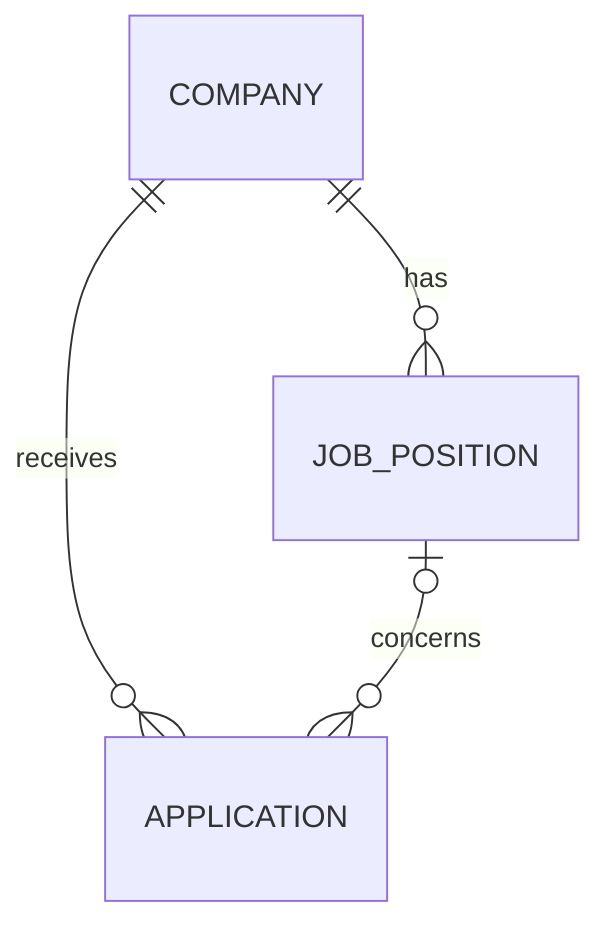

# JobScout Data Model

## Purpose

This document describes the data that JobScout needs to store for the MVP.

The model is relational because one company can have multiple job positions and
multiple applications.

## Main Entities

### Company

A company is a potential employer in Germany.

Planned properties:

- `Id`
- `Name`
- `Location`
- `WebsiteUrl`
- `CareerPageUrl`
- `TechnologyNotes`
- `InitiativeApplicationPossibility`
- `CreatedAt`
- `UpdatedAt`

### JobPosition

A job position is a specific vacancy published by a company.

Planned properties:

- `Id`
- `CompanyId`
- `Title`
- `JobUrl`
- `Description`
- `IsOpen`
- `GermanLanguageLevel`
- `EnglishAccepted`
- `CreatedAt`
- `UpdatedAt`

`CompanyId` connects the job position to its company.

### Application

An application records an application-related activity.

An application may refer to a specific job position or to a company generally.
If `JobPositionId` is empty, the application represents an initiative
application.

Planned properties:

- `Id`
- `CompanyId`
- `JobPositionId` (optional)
- `Status`
- `Notes`
- `AppliedOn`
- `CreatedAt`
- `UpdatedAt`

## Relationships

- One company can have many job positions.
- One company can have many applications.
- One job position can have zero or more applications.
- An application can optionally refer to one specific job position.
- An application without a job position represents an initiative application.

## Enumerations

### InitiativeApplicationPossibility

Possible values:

- `Unknown`
- `Possible`
- `NotPossible`

### GermanLanguageLevel

Possible values:

- `NotSpecified`
- `NoGermanRequired`
- `A1`
- `A2`
- `B1`
- `B2`
- `C1`
- `C2`

### ApplicationStatus

Possible values:

- `NotApplied`
- `Planned`
- `Applied`
- `Interview`
- `Rejected`
- `Offer`

## Design Decisions

### Why separate companies and job positions?

A company can publish several relevant positions. Separating these entities avoids
duplicating company information.

### Why use an application entity?

Application status may belong to a specific position, but initiative applications
do not have a position. An optional `JobPositionId` supports both cases.

### Why use enumerations?

Values such as application status and German language level should be controlled
and consistent. Enumerations prevent many spelling variations in the database.

### Personal data

The MVP will not store:

- CV files;
- cover letters;
- phone numbers;
- private addresses;
- other sensitive personal information.

## MVP Simplification

The first version will use one MySQL database and Entity Framework Core.

The model may be extended later, but new fields should only be added when they
support a documented requirement.